<div align="center">



</div>

# 万能爬虫框架

> **项目状态：个人初版 v0.1**
>
> 自己搭着用的爬虫工具，静态网站基本能爬（direct 渲染 + CSS 选择器 + 翻页 + Excel 导出）。
> 复杂动态站、强反爬的还搞不定，bug 也不少，慢慢改。

一站式网页数据采集框架，包含**两条可用的爬虫路径**：

1. **通用配置化引擎**（主力）：`examples/universal_crawler.py` —— 只需一份 JSON CONFIG 描述目标站即可爬取，支持
   静态站/JS 动态站、API 接口抓包、代理轮换、反爬挑战回退、去重、并发、字段清洗、断点续爬、SQLite 持久化。
2. **Scrapy 分布式框架**（原有）：基于 Scrapy + Scrapy-Redis，支持动态渲染、代理池、Bloom Filter 去重、清洗流水线、LLM 辅助提取、监控。

配套 **可视化控制台**（`web/`）：浏览器打开即可配置爬取任务、实时日志、站点探测、数据统计，无需写代码。

---

## ⚠️ 合法性与使用须知

**本项目仅用于学习、研究和合法的数据采集用途。** 使用前请务必阅读并遵守以下条款：

1. **遵守法律法规**：不得用于窃取商业机密、个人隐私、受版权保护的内容，不得违反《网络安全法》《数据安全法》《个人信息保护法》等相关法律法规。
2. **遵守目标网站规则**：爬取前请阅读目标网站的 `robots.txt` 和服务条款（Terms of Service），尊重网站的爬取禁令。
3. **合理控制频率**：设置合理的请求间隔（`delay`），避免对目标服务器造成压力；建议开启 `respect_robots: true`。
4. **数据用途合规**：采集到的数据不得用于非法转售、恶意竞争、骚扰等用途；涉及个人信息的数据需取得授权或做匿名化处理。
5. **风险自担**：因不当使用本工具导致的任何法律责任，由使用者自行承担，与项目作者无关。

> 一句话：**只爬公开数据、只做合法用途、别把人家服务器搞挂。**

---

## 快速开始（通用引擎 + 可视化控制台）

### 1. 启动控制台

**方式一：一键启动（推荐）**

先激活 Python 环境，然后双击 `run_web.bat`：

```bash
# 激活环境（conda 示例）
conda activate spider
# 然后双击 run_web.bat，或命令行运行
run_web.bat
```

**方式二：命令行启动**

```bash
conda activate spider
python web\app.py
```

浏览器访问 <http://127.0.0.1:5000>：

```
顶部工作栏   → WebSocket 状态、核心引擎标识
左侧配置面板 → 站点探测器 + 模板加载 + 渲染/翻页/字段配置 + 高级选项（代理/API/去重/并发/清洗/续爬/存储）
右侧面板     → 数据统计条 + 任务状态 + 实时日志（终端风格）+ 结果表格（可下载 Excel）
```

### 2. 使用流程

1. **站点探测**：输入 URL → 点「探测」→ 自动识别渲染方式/翻页类型/内容容器/字段候选 → 点击填入表单
2. **加载模板**：直接选用内置模板（网上书店/名人名言/软科排名/淘宝）
3. **提交爬取**：配置完成后点「开始爬取」→ 实时日志 + 结果表格
4. **导出数据**：Excel / CSV / SQLite（开启 storage 后自动写库）

### 3. 引擎直接调用（Python）

```python
import sys
sys.path.insert(0, "examples")
from universal_crawler import crawl, probe_site

# 探测站点 → 拿推荐配置
info = probe_site("http://books.toscrape.com/catalogue/page-1.html")
print(info["render"], info["item_candidates"])

# 直接爬取
config = {
    "name": "网上书店",
    "render": "direct",                                   # direct / playwright
    "pagination": {"type": "url_pattern",
                   "url_pattern": "http://books.toscrape.com/catalogue/page-{page}.html",
                   "start_page": 1, "max_pages": 2},
    "item_selector": "article.product_pod",
    "fields": {"书名": "h3 a::attr(title)", "价格": "p.price_color::text"},
    "delay": 0.3,
    # —— 以下均为可选高级项 ——
    "concurrency": 4,                                     # 翻页并发
    "dedup": {"key": "书名"},                             # 去重字段
    "postprocess": {"价格": {"remove": "£"}},             # 字段清洗
    "proxy": "http://127.0.0.1:7890,http://192.168.1.2:8080",  # 代理池（逗号分隔/轮换/回退直连）
    "respect_robots": True,                               # robots.txt 合规
    "resume": True,                                       # 断点续爬
    "storage": {"type": "sqlite", "table": "items"},      # SQLite 存储
    "api": {"item_path": "data.items", "fields": {"书名": "title"}},  # API 抓包
}
items = crawl(config)   # 返回 List[dict]，同时写 data/demo/{name}.xlsx(.csv)
```

### 4. 配置项总览

| 配置 | 默认 | 说明 |
|---|---|---|
| `render` | direct | `direct` 静态直连（curl_cffi TLS 指纹模拟）/ `playwright` 浏览器渲染（stealth 反检测） |
| `pagination.type` | none | `url_pattern` 网址翻页 / `next_button` 点按钮 / `infinite_scroll` 无限滚动 / `none` 单页 |
| `item_selector` | — | 每条内容的 CSS 选择器（如 `article.product_pod`） |
| `fields` | — | 字段映射：列名 → `选择器::text` 或 `选择器::attr(attr)` |
| `api` | — | JSON 接口提取：`{item_path, fields}`（优先于 DOM，url_pattern 下按页隔离） |
| `proxy` / `proxies` / `proxy_file` | — | 代理池：逗号分隔多代理 / 列表 / 文件（失败自动切换，全失败回退直连） |
| `dedup` | — | 去重：`{key: "链接"}`；字段为空的条目永不删除（防漏） |
| `concurrency` / `detail_concurrency` | 1 | 翻页并发 / 详情页并发（按页号排序合并保序） |
| `postprocess` | — | 字段清洗：`{字段: {strip/collapse_ws/lower/upper/digits_only/remove/regex_replace}}` |
| `respect_robots` | false | robots.txt 合规检查（获取失败自动放行） |
| `resume` | false | 断点续爬（按页存 `data/resume/{任务名}.jl`，重跑跳过已完成页） |
| `storage` | — | SQLite：`{type:"sqlite", table:"items"}`（与 Excel/CSV 并存，幂等去重） |
| `headless` / `user_agent` / `storage_state` | — | playwright 参数：无头/UA/登录态 cookie 文件 |

### 5. 指路牌（选择器）语法

```
h3 a::text          取标题文字
h3 a::attr(href)    取链接
img::attr(src)      取图片地址
p.price::text       取价格
```

---

## 目录结构

```
spider-framework/
├── run_web.bat                  # ★ 一键启动 Web 控制台（双击即可）
├── run.py                       # Scrapy 启动入口
├── web/                         # ★ 可视化控制台（主力入口）
│   ├── app.py                   #   Flask + SocketIO 后端
│   ├── templates/index.html     #   单页控制台界面
│   └── static/
│       ├── css/style.css        #   深沉暗色设计系统
│       └── js/app.js            #   前端逻辑
├── examples/                    # ★ 通用引擎与模板
│   ├── universal_crawler.py     #   通用配置化引擎（crawl / probe_site）
│   └── 00_空白模板.py           #   配置模板（改 CONFIG 即可爬任意站）
├── core/                        # 核心模块
│   ├── engine/runner.py         #   Scrapy 运行器
│   ├── request/requester.py     #   请求层（curl_cffi / httpx，支持自定义 headers）
│   ├── renderer/                #   Playwright 渲染（stealth）
│   ├── middleware/              #   下载中间件
│   └── pipeline/                #   数据管道
├── proxy/                       # 代理池（Redis）
├── dedup/                       # 去重调度（Bloom Filter）
├── cleaner/                     # 清洗流水线（规则 + LLM 辅助）
├── spiders/                     # Scrapy 业务爬虫
├── monitor/                     # Prometheus 监控
├── storage/                     # 存储（PostgreSQL）
├── config/                      # 配置
├── utils/                       # 工具（指纹/UA/日志）
├── scripts/                     # 辅助脚本
│   ├── activate_spider.bat       #   环境激活
│   ├── run_spider.bat            #   命令行爬虫启动
│   ├── verify_env.py             #   环境自检
│   └── init_db.sql               #   数据库初始化
├── data/                        # 运行时数据（Excel/CSV/SQLite/断点）
├── logs/                        # 日志
├── IMPROVEMENTS.md              # 迭代改进记录
├── docker-compose.yml           # Redis + PostgreSQL + Prometheus + Grafana
└── requirements.txt             # Python 依赖
```

---

## 路径二：Scrapy 分布式框架（原有）

面向大规模、多机分布式场景：Scrapy + Scrapy-Redis，配合代理池、Bloom Filter 去重、清洗流水线、LLM 辅助提取与 Prometheus 监控。

## 环境（本机已搭建）

| 项目 | 路径 |
|---|---|
| conda 环境 | `D:\79458\Documents\anaconda3\envs\spider`（Python 3.11） |
| Playwright 浏览器 | `D:\conda_cache\playwright`（Chromium，约 706MB） |
| pip 缓存 / 配置 | `D:\conda_cache\pip` / `D:\conda_cache\pip.ini`（清华源） |
| 抓取数据 | `data\raw`、`data\cleaned` |
| 日志 | `logs` |

激活环境：

```bat
D:\79458\Documents\anaconda3\Scripts\activate.bat D:\79458\Documents\anaconda3\envs\spider
```

> 环境自检：`python scripts\verify_env.py` → 浏览器启动成功 / 模块导入通过 / 数据目录全在 D 盘。

## 启动基础设施（可选，单机模式跳过）

```bash
docker-compose up -d
# Redis: localhost:6379 | PostgreSQL: localhost:5432（spider / spider123 / spider_data）
# Prometheus: localhost:9090 | Grafana: localhost:3000（admin / admin123）
```

## 运行示例爬虫

```bash
# 单机模式（不需要 Redis）
python run.py ecommerce_demo --single
python run.py news_demo --single

# 分布式模式（先 docker-compose up -d 启动 Redis）
python run.py ecommerce_demo

# 指定 URL
python run.py news_demo --urls http://quotes.toscrape.com/
```

## 编写新爬虫（Scrapy）

```python
from spiders.base_spider import BaseSpider

class MySpider(BaseSpider):
    name = "my_spider"
    redis_key = "my_spider:start_urls"
    start_urls = ["https://example.com"]

    def parse(self, response):
        yield self.build_item(
            url=response.url,
            title=response.css("title::text").get(),
        )
```

## 代理池（Scrapy 中间件路径）

```python
from proxy.pool.manager import ProxyPool
pool = ProxyPool()
pool.add_proxy("http://127.0.0.1:7890")
pool.load_from_file("proxies.txt")          # 每行一个代理
proxy = pool.get_proxy(domain="example.com")  # 按域名绑定
```

> 通用引擎路径的代理使用方式更简单：直接 `config["proxy"] = "http://a:1,http://b:2"`，自动轮换 + 回退直连，无需 Redis。

## LLM 辅助清洗

```python
from cleaner.pipeline import CleanPipeline
pipeline = CleanPipeline()
result = pipeline.llm_extract(
    data={"description": "iPhone 15 Pro, 256GB, 深空黑色"},
    fields=["品牌", "型号", "容量", "颜色"], source_field="description",
)
```

## 监控指标

访问 `http://localhost:9100/metrics`：
- `spider_request_total`（按站点/状态码）、`spider_request_latency_seconds`
- `spider_item_scraped_total`、`spider_proxy_available`、`spider_queue_size`、`spider_dedup_hit_total`

---

## 迭代记录

每轮改进（能力/配置/验证）详见 **[IMPROVEMENTS.md](IMPROVEMENTS.md)**：

1. **迭代1**：核心缺陷补齐（代理、stealth、WAF 挑战回退、无限滚动修复、指数退避）
2. **迭代2**：API 接口响应捕获（XHR 抓包）
3. **迭代3**：数据去重（防漏）+ 并发抓取
4. **迭代4**：反爬加固（代理轮换/回退直连、robots 合规、字段后处理）
5. **迭代5**：SQLite 持久化 + 断点续爬
6. **迭代6**：站点指纹识别（探测器）+ 数据统计面板

## 目前的坑和注意事项

### 还没搞定的

1. **静态网站基本能爬**：direct 渲染 + CSS 选择器 + 网址翻页/单页模式已经试过能用
2. **复杂动态站搞不定**：淘宝未登录、要滑块验证的那些站，要么爬失败要么数据不全
3. **playwright 偶尔抽风**：有些页面元素没加载完、弹窗干扰，得自己调 `page_wait`
4. **分布式没怎么测**：Scrapy-Redis 代码写了，但多机大规模跑没试过
5. **LLM 清洗要自己配 Key**：DeepSeek / 通义千问的 API Key 得自己填，本地小模型不够用

### 用的时候注意

1. 遵守目标网站 `robots.txt` 与服务条款，合理控制抓取频率（可用 `respect_robots` / `delay`）
2. 通用引擎默认单机运行；超大规模采集建议走 Scrapy 分布式路径
3. 代理池默认自建模式，需手动添加代理或从文件加载
4. 天气网等部分站点需在「自定义请求头」中填写 `Referer` 才能正常访问
5. `data/resume/*.jl` 是断点进度文件，删除后下次会重新抓全量
6. 遇到爬取失败时，先看实时日志里的状态码和错误信息，多数情况是反爬拦截或选择器不匹配